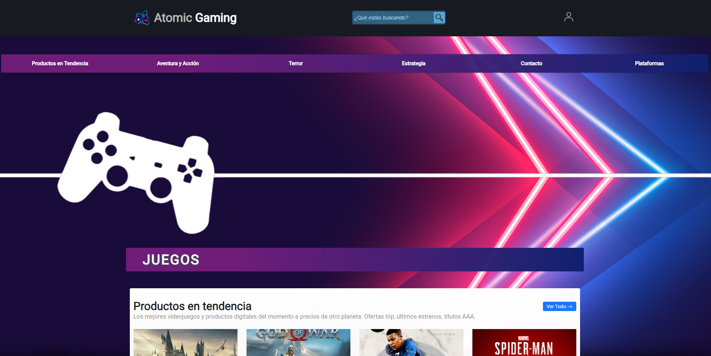
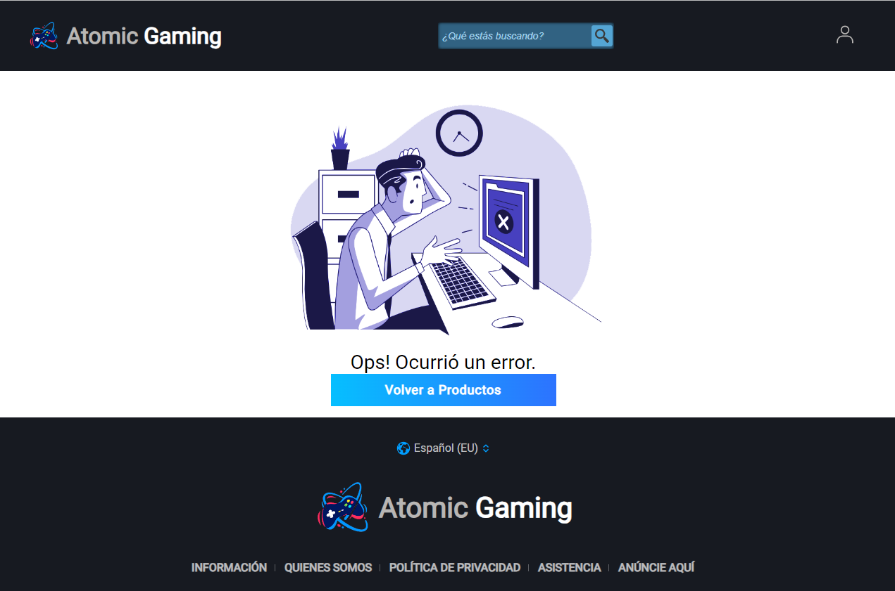

# Challenge E-commers: Atomic Gaming





# Demo

A través de este link podrás tener acceso a la demo en github Pages del e-commers.
[Puedes ver el proyecto aquí 🚀](https://emanuel-lamberti.github.io/Challenge-E-commerce-atomic-gaming/)

---

## Sección Principal

El menú principal nos muestra un catálogo de productos filtrados por categorías.

## Seccion Usuario

Puedes loguearte al sistema con las credenciales:

<ul>
    <li>Usuario: Josef</li>
    <li>Password: alura123</li>
</ul>
Una vez ingresado al sistema de administración puedes visualizar en la parte del header el nombre del usuario, donde tienes la opción de cerrar sesión y volver al menú principal de todos los productos.

## Buscar Producto

Puedes buscar un producto dentro de la pestaña 'Todo los productos' (por implementar en index o pestaña principal).

## Sección Productos

Una vez ingresado al sistema de administración puedes visualizar todos los productos que se agregaron a la base de datos.
Puedes realizar las siguientes acciones CRUD:

- Visualizar los productos ('GET')
- Agregar producto ('POST')
- Editar producto ('PUT')
- Eliminar productos ('DELETE')

## Sección Agregar y Editar Productos

En esta sección te muestra un formulario con las respectivas validaciones, el cual debes llenar:

- El link de una imagen (subida a la nube).
- La categoría a la que pertenece.
- El nombre del producto.
- El precio inicial (precio sin descuento).
- Descuento que se realizará al precio inicial, equivalente a un porcentaje (%).
- Y una descripción.

---

# Getting Started

Clona este repositorio en tu maquina local usando el comando "git clone".

```
    # Clone the repository
    $ git clone https://github.com/Emanuel-Lamberti/Challenge-E-commerce-atomic-gaming.git
    # Move into the repository
    $ cd Ecommerce_Games.git
```

- Instala las dependencias

```
    $ npm install
```

- Inicia el servidor con

```
    $ npm run vite
```

# Stack and tools 🛠️

Las únicas herramientas utilizadas fueron Html, Css, JavaScript y JsonServer.
No se usaron librerías ni packetes.

# Características Adicionales

- Uso de PromiseAll: mejorar el performance del proyecto.
- Spinner css agregado.
- Filtro por categorías agregado.
